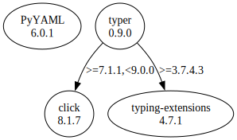

# Third Party Dependencies

<!--[[[fill sbom_sha256()]]]-->
The [SBOM in CycloneDX v1.4 JSON format](https://git.sr.ht/~sthagen/visailu/blob/default/etc/sbom/cdx.json) with SHA256 checksum ([1a0b8c62 ...](https://git.sr.ht/~sthagen/visailu/blob/default/etc/sbom/cdx.json.sha256 "sha256:1a0b8c6278910c27b1fd456ccf43b6bb5429c27c5fdd6ee856fee6360cfaaa9a")).
<!--[[[end]]] (checksum: d1b31e9189480e18c81bd8938f97b90a)-->
## Licenses 

JSON files with complete license info of: [direct dependencies](direct-dependency-licenses.json) | [all dependencies](all-dependency-licenses.json)

### Direct Dependencies

<!--[[[fill direct_dependencies_table()]]]-->
| Name                                       | Version                                        | License     | Author            | Description (from packaging data)                                  |
|:-------------------------------------------|:-----------------------------------------------|:------------|:------------------|:-------------------------------------------------------------------|
| [typer](https://github.com/tiangolo/typer) | [0.9.0](https://pypi.org/project/typer/0.9.0/) | MIT License | Sebastián Ramírez | Typer, build great CLIs. Easy to code. Based on Python type hints. |
<!--[[[end]]] (checksum: 80e791c1fdef7665f4104495541de7b1)-->

### Indirect Dependencies

<!--[[[fill indirect_dependencies_table()]]]-->
| Name | Version | License | Author | Description (from packaging data) |
|:-----|:--------|:--------|:-------|:----------------------------------|
<!--[[[end]]] (checksum: 8a87b89207db0be2864af66f9266660c)-->

## Dependency Tree(s)

JSON file with the complete package dependency tree info of: [the full dependency tree](package-dependency-tree.json)

### Rendered SVG

Base graphviz file in dot format: [Trees of the direct dependencies](package-dependency-tree.dot.txt)



### Console Representation

<!--[[[fill dependency_tree_console_text()]]]-->
````console

````
<!--[[[end]]] (checksum: 3c785458cb78583f093698f578ae7d19)-->
